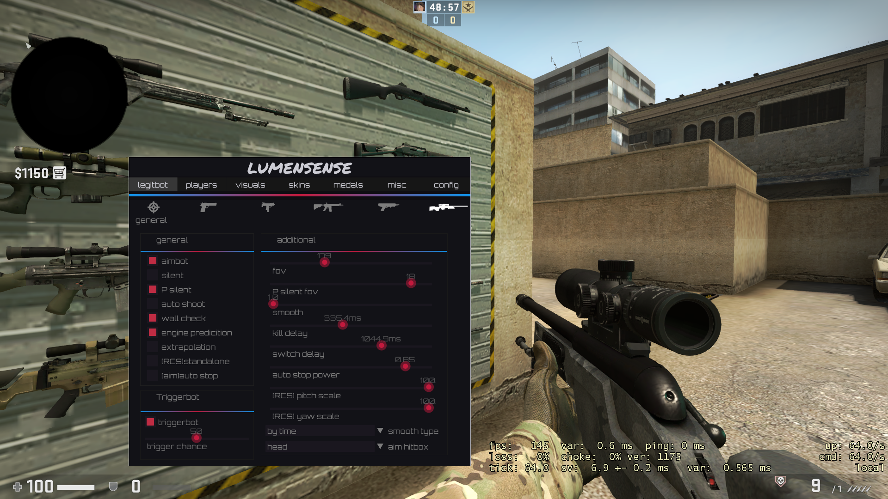
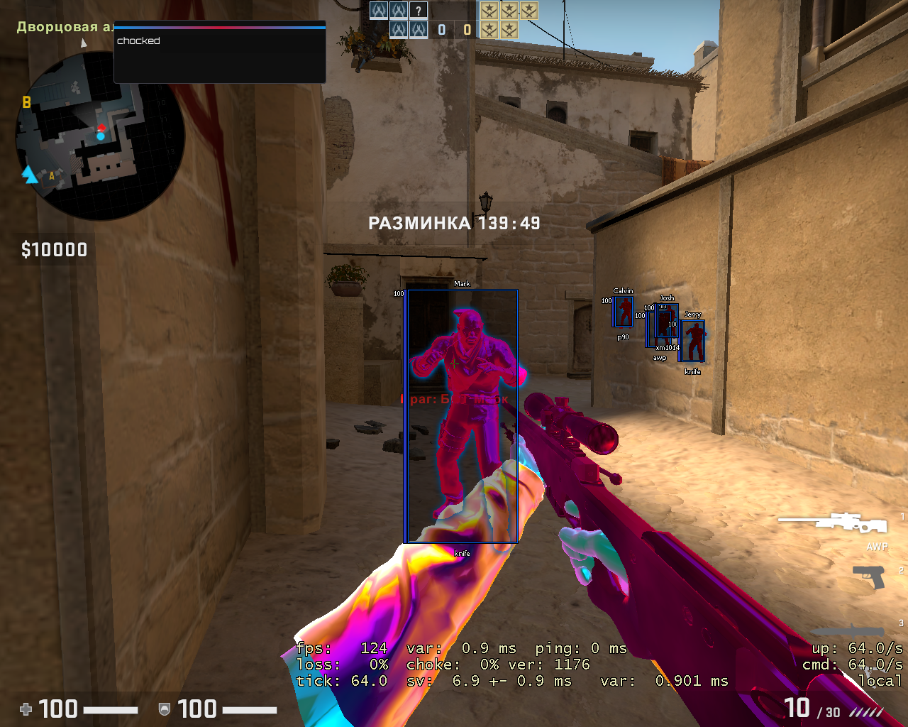

# LumenSense csgo hack

## How to start:

- download any `LoadLibrary/Manual Map` injector
- compile the program at `release x86`
- inject dll into `csgo.exe`
- For unhook : `press DELETE`

### Functions

#### Misc

- slow walk [`misc/slow walk/power[0-100]`]
- fake lags [`misc/fakelags/factor[0-14]`], [`fakelag type`]
- extended backtrack [`aimbot/backtrack`]
- bunny hope
- auto strafe [`bunny hope`]
- moon walk
- radar hack
- hit sound [`misc/hitsound type`]
- hit marker [`visuals`]
- kill spam
- other
  - third person distance
  - viemodel fov
  - viewmodel_offset_x
  - viewmodel_offset_y
  - viewmodel_offset_z

#### Legitbot

- weapon type selector
- general
  - aimbot [`bind key`]
  - silent aim
  - perfect silent aim
  - auto shoot [`bind key`]
  - aim wall check
  - engine prediction
  - extrapolation
  - RCS(standalone)
  - auto stop
  - backtrack
  - aim hit nearest
- triggerbot
  - triggerbot [`bind key`]
  - trigger chance [`0-100%`]
  - trigger delay [`0-1000ms`]
- additional
  - fov [`1-360`]
  - perfect silent fov [`1-20`]
  - smooth [`1.0-10.0`]
  - kill delay [`1-1000ms`]
  - switch delay [`1-1000ms`]
  - auto stop power [`0.0-1.0`]
  - RCS pitch scale [`0-100%`]
  - RCS yaw scale [`0-100%`]
  - smooth type
  - aim hitbox
  - target priority
  - fov type

#### Players

- chams
  - chams
  - ignore z buffer [`chams`]
  - arm chams
  - weapon chams
  - sleeves chams
  - backtrack chams
- surface render
  - enabled
  - team esp
  - box esp
  - sound esp
  - name esp
  - hp esp
  - weapon esp
  - skeleton esp
  - armor esp
    - additional
      - weapon icons
      - line esp
      - ammo esp
      - draw distance
      - draw players speed
      - hp position [`combobox`]
      - sound esp material [`combobox`]
      - sound esp life [`1-5s`]
      - sound esp width [`1-5`]
      - sound esp radius [`10-150`]
- effects
  - trails rainbow
  - trails lifetime
  - trails color
  - trails type
  - glow
  - glow thikness
  - dlight
  - dlight rainbow
  - dlight radius
  - dlight time

#### Visuals

- general
  - draw aim fov
  - show aim target
  - show weapon spread
  - force crosshair
  - remove scope
  - enable thirdperson camera
  - kill effect [`combo/kill effect type`]
  - wireframe smoke
  - remove smoke
  - ring while hit
  - remove 3d sky
  - remove shadows
  - bullet tracers
  - bullet tracers type
  - bullet traceres lifetime
  - bullet tracer fade
  - bullet tracers width
  - post processing(color)
  - bright world

## Show case :
### backtrack 

